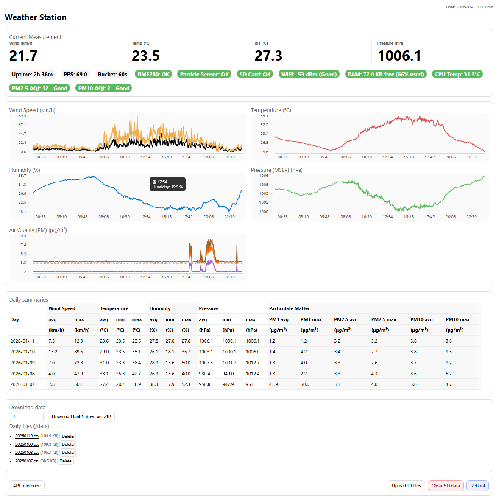

# ESP32-C3 Weather Station

This project implements a **Wi‑Fi connected weather station** using an **ESP32‑C3**, a **pulse-based anemometer**, a **BME280** (temperature, humidity, pressure), a **PMS5003** (particulate matter sensor), and an **SD card** for long-term storage.

It provides:

* Windspeed from pulse anemometer (1-second sampling)
* Default 1-minute aggregated logging (adjustable), aligned to real time (NTP)
* Daily CSV files with configurable retention
* A built-in web UI with interactive plots
* A REST API with current and historical sensor data
* CSV and ZIP download endpoints
* Password-protected file management



---

## Hardware requirements

* **ESP32-C3**
* **Pulse anemometer**
  * Connected to **GPIO 3** (configurable via `WindConfig::PULSE_PIN` in `config.h`)
  * 2ms debounce filter implemented in ISR to prevent spurious triggers (max reading is ~ 157km/h)
* **BME280** (I2C)
  * Default address `0x76` (fallback `0x77`)
  * Uses the board's default SDA/SCL pins (`Wire.begin()`)
  * Altitude correction configurable via `BME280Config::ALTITUDE_METERS` in `config.h`
* **PMS5003** (UART)
  * RX -> **GPIO 4** (configurable via `PMS5003Config::RX_PIN` in `config.h`)
  * TX -> **GPIO 5** (configurable via `PMS5003Config::TX_PIN` in `config.h`)
  * Measures PM1.0, PM2.5, and PM10 particulate matter
  * Automatically calculates AQI (Air Quality Index)
  * Can be disabled via `PMS5003Config::ENABLE = false` in `config.h`
* **Micro SD card module** (SPI)
  * CS -> **GPIO 20** (configurable via `SDConfig::CS_PIN` in `config.h`)
  * Uses your board's SPI pins for SCK/MISO/MOSI

### Example Build


*Example of a complete weather station build with 3D printed enclosure*

---

## Wind speed calculation

```
20 pulses / second = 1.75 m/s
1 pulse / second  = 0.0875 m/s
```

Wind speed is calculated linearly from pulse rate over a 1-second window.

---

## Time handling

* **Requires WiFi connection** for timestamped logging
* Uses **WiFiManager** for Wi‑Fi setup/configuration
* Uses **NTP** for time sync
* Timezone configured via `TZ` string (default: Australia/Sydney)
* All logging aligned to:
  * **Default 1-minute boundaries** (adjustable via `BUCKET_SECONDS`)
  * **Local midnight rollovers**

---

## Data logging

### Logging interval

* **Every 1 minute** (configurable via `LogConfig::BUCKET_SECONDS` in `config.h`)
* Wind speed sampled once per second into each bucket

### Logged fields

Each row contains:

| Field         | Description                           |
| ------------- | ------------------------------------- |
| `datetime`    | Local time (`YYYY-MM-DD HH:MM`)       |
| `epoch`       | Unix epoch (seconds)                  |
| `wind_avg_ms` | Average wind over bucket (m/s)        |
| `wind_max_ms` | Max wind over bucket (m/s)            |
| `temp_c`      | Temperature (°C)                      |
| `hum_rh`      | Relative humidity (%)                 |
| `press_hpa`   | Pressure (hPa)                        |
| `pm1`         | PM1.0 particulate matter (μg/m³)      |
| `pm25`        | PM2.5 particulate matter (μg/m³)      |
| `pm10`        | PM10 particulate matter (μg/m³)       |
| `samples`     | Number of wind samples in bucket      |

---

## SD card

FAT32 formatted

```
/
└── data/
    ├── YYYYMMDD.csv          # One per day (1-min rows)
    └── ...
└── web/
    ├── index.html
    └── app.js
```

### Daily files (`/data`)

* One CSV per day
* Automatically deleted after `RETENTION_DAYS` (default: 0 = never delete)
* See Configuration options below for details

---

## Configuration options

All configuration is in `config.h` using namespaces:

```cpp
// Security
static const char* API_PASSWORD = "ChangeMe";

// Wind sensor pins and calibration
namespace WindConfig {
  static constexpr int PULSE_PIN = 3;                    // GPIO pin
  static constexpr float PPS_TO_MS = 1.75f / 20.0f;      // 20pps = 1.75m/s
}

// BME280 environmental sensor
namespace BME280Config {
  static constexpr bool ENABLE = true;
  static constexpr float ALTITUDE_METERS = 580.0f;       // For MSLP calculation
}

// PMS5003 air quality sensor
namespace PMS5003Config {
  static constexpr bool ENABLE = true;
  static constexpr int RX_PIN = 4;
  static constexpr int TX_PIN = 5; // not technically needed
}

// SD card
namespace SDConfig {
  static constexpr int CS_PIN = 20;
}

// Data logging
namespace LogConfig {
  static constexpr int BUCKET_SECONDS = 60;              // 1 minute intervals
  static constexpr int RETENTION_DAYS = 0;               // 0 = never delete
  static constexpr int DAYS_HISTORY = 30;                // History available/shown for /api/days
}

// Web UI
namespace UIConfig {
  static constexpr int FILES_PER_PAGE = 30;
  static constexpr int MAX_PLOT_POINTS = 500; // limit for perfromance
}
```

* `API_PASSWORD`: Password for protected operations (default: "ChangeMe")
* `LogConfig::BUCKET_SECONDS`: How often data is logged (default 1 minute = 60 seconds)
* `LogConfig::RETENTION_DAYS`: Auto-delete CSV files older than this many days (0 = never delete)
* `UIConfig::FILES_PER_PAGE`: Number of files shown per page in the CSV download section
* `UIConfig::MAX_PLOT_POINTS`: Maximum number of points rendered on plots. When zooming, this limit applies only to the visible region, revealing more detail.
* `PMS5003Config::ENABLE`: Enable/disable particulate matter sensor
* `BME280Config::ALTITUDE_METERS`: Station altitude for mean sea level pressure calculation

---

## Storage usage (typical)

Assuming ~100 bytes per row (with PM data):

* 1440 rows/day ≈ **100 KB/day**
* 365 days (1 year) ≈ **~50 MB**
* 3650 days (10 years) ≈ **~500 MB**

---

## Web UI

Open in browser:

```
http://<device-ip>/
```

### UI features

* **Current readings:**
  * Wind speed (km/h), pulses per second
  * Temperature, humidity, pressure
  * PM1.0, PM2.5, PM10 levels with AQI (Air Quality Index)
  * Sensor status indicators
  * Uptime and RAM usage

* **Last 24h graphs:**
  * Wind speed (average and max lines with dual hover dots)
  * Temperature, humidity, and pressure
  * Air quality (PM1.0, PM2.5, PM10)
  * **Interactive zoom:** Click and drag to zoom, double-click to reset
  * Auto-scaling y-axis when zoomed to show detail in visible range
  * Smart tooltip positioning (auto-adjusts near edges)

* **Daily summaries table:**
  * Wind, temperature, humidity, pressure, and PM min/max/avg
  * Scrollable with sticky date column
  * Sorted from most recent to oldest

* **File management:**
  * Paginated CSV file list (30 per page, configurable)
  * Individual file download and deletion (password protected)
  * ZIP download of last N days
  * Clear all SD data button (password protected)

* **System controls:**
  * Reboot device button
  * RAM usage monitor

---

## REST API specification

### 1) Current status

**GET** `/api/now`

Returns current sensor state.

Example:

```json
{
  "epoch": 1734492345,
  "local_time": "2025-12-18 22:25",
  "wind_pps": 0.7,
  "wind_ms": 1.2,
  "bme280_ok": true,
  "temp_c": 23.4,
  "hum_rh": 55.1,
  "press_hpa": 1012.3,
  "pms5003_ok": true,
  "pm1": 5.2,
  "pm25": 12.8,
  "pm10": 18.4,
  "aqi_pm25": 52,
  "aqi_pm25_category": "Moderate",
  "aqi_pm10": 45,
  "aqi_pm10_category": "Good",
  "sd_ok": true,
  "cpu_temp_c": 45.2,
  "uptime_s": 12345,
  "retention_days": 360,
  "wifi_rssi": -65,
  "free_heap": 245000,
  "heap_size": 327680
}
```

---

### 2) Last 24h sensor buckets

**GET** `/api/buckets`

* Returns sensor buckets for the last 24 hours (default 1-minute intervals)
* Includes wind, temperature, humidity, pressure, and particulate matter data
* Uses descriptive property names for clarity
* Chunked transfer encoding to handle large responses

Example:

```json
{
  "now_epoch": 1734158023,
  "bucket_seconds": 60,
  "buckets": [
    {
      "timestamp": 1734140200,
      "wind_speed_avg": 1.12,
      "wind_speed_max": 2.34,
      "wind_speed_samples": 60,
      "temperature": 23.5,
      "humidity": 54.2,
      "pressure": 1012.6,
      "pm1": 5.2,
      "pm25": 12.8,
      "pm10": 18.4
    }
  ]
}
```

**Units:**
- wind_speed (m/s)
- temperature (°C)
- humidity (%)
- pressure (hPa)
- pm1/pm25/pm10 (μg/m³)

---

### 3) Last 24h sensor buckets (compact format)

**GET** `/api/buckets_compact`

* Internal endpoint used by the web UI
* Array format (no keys) for size reduction
* Each bucket is an array of 10 full-precision numbers
* Chunked transfer encoding with batching for performance

Example:

```json
{
  "now_epoch": 1734492345,
  "bucket_seconds": 60,
  "buckets": [
    [1734489600, 0.8, 2.1, 12, 22.9, 56.0, 1012.1, 5.2, 12.8, 18.4]
  ]
}
```

**Array indices:**
- `[0]` = timestamp (epoch seconds)
- `[1]` = average wind (m/s)
- `[2]` = max wind (m/s)
- `[3]` = sample count
- `[4]` = temperature (°C)
- `[5]` = humidity (%)
- `[6]` = pressure (hPa)
- `[7]` = PM1.0 (μg/m³)
- `[8]` = PM2.5 (μg/m³)
- `[9]` = PM10 (μg/m³)

---

### 4) Daily summaries (RAM)

**GET** `/api/days`

Returns daily summaries for wind, temperature, humidity, pressure, and particulate matter from RAM (last 30 days + current day).

Example:

```json
{
  "days": [
    {
      "dayStartEpoch": 1734480000,
      "dayStartLocal": "2025-12-18 00:00",
      "avgWind": 1.2,
      "maxWind": 5.8,
      "avgTemp": 24.1,
      "minTemp": 19.5,
      "maxTemp": 28.0,
      "avgHum": 58.2,
      "minHum": 44.0,
      "maxHum": 71.5,
      "avgPress": 1012.5,
      "minPress": 1008.2,
      "maxPress": 1016.8,
      "avgPM1": 5.3,
      "maxPM1": 8.2,
      "avgPM25": 12.4,
      "maxPM25": 18.9,
      "avgPM10": 18.1,
      "maxPM10": 25.7
    }
  ]
}
```

---

### 5) List CSV files

**GET** `/api/files`

Lists available CSV files in the data directory.

Example:

```json
{
  "ok": true,
  "dir": "data",
  "files": [
    {
      "path": "20251218.csv",
      "size": 12345
    },
    {
      "path": "20251217.csv",
      "size": 12001
    }
  ]
}
```

---

### 6) List web UI files

**GET** `/api/ui_files`

Lists web UI files (index.html, app.js) stored on the SD card with size and modification time.

Example:

```json
{
  "ok": true,
  "files": [
    {
      "file": "index.html",
      "size": 8192,
      "lastModified": 1734492345
    },
    {
      "file": "app.js",
      "size": 45678,
      "lastModified": 1734492350
    }
  ]
}
```

---

### 7) Download a single CSV

**GET** `/download?filename=20251214.csv`

* Forces browser download
* Only allows `.csv` files
* Path traversal blocked

---

### 8) Download last N days as ZIP

**GET** `/download_zip?days=N`

Examples:

```
/download_zip           -> defaults to 7 days
/download_zip?days=3
/download_zip?days=30
```

* Streams ZIP directly (no temp files)
* Uses ZIP **STORE** mode (no compression)
* Includes only existing `YYYYMMDD.csv` files
* `days` is clamped to `1 .. RETENTION_DAYS` (when `RETENTION_DAYS` > 0), or no upper limit (when `RETENTION_DAYS` = 0)

ZIP filename:

```
last_<N>_days.zip
```

---

### 9) Upload web UI files (password protected)

**POST** `/upload`

Uploads files to the SD card (typically web UI files like index.html or app.js).

* Requires password authentication
* Rate limited: 10 attempts per hour
* Uses multipart form data

Parameters:
- `file`: File to upload
- `path`: Destination path (e.g., `/web/index.html`)
- `pw`: Password

Example:

```bash
curl -F "file=@index.html" -F "path=/web/index.html" -F "pw=ChangeMe" http://<device-ip>/upload
```

Response:

```json
{
  "ok": true,
  "bytes": 12345
}
```

---

### 10) Delete a single file (password protected)

**POST** `/api/delete`

* Deletes a single CSV file
* Requires password authentication
* Rate limited: 10 attempts per hour

Parameters:
- `filename`: CSV filename (e.g., `20251214.csv`)
- `pw`: Password

Example:

```bash
curl -X POST http://<device-ip>/api/delete \
  -d "filename=20251214.csv&pw=ChangeMe"
```

Response:

```json
{"ok": true}
```

---

### 11) Clear all SD data (password protected)

**POST** `/api/clear_data`

* Deletes all CSV files
* Requires password authentication
* Rate limited: 10 attempts per hour

Parameters:
- `pw`: Password

Example:

```bash
curl -X POST http://<device-ip>/api/clear_data \
  -d "pw=ChangeMe"
```

Response:

```json
{
  "ok": true
}
```

---

### 12) Reboot device (password protected)

**POST** `/api/reboot`

* Reboots the ESP32 device
* Requires password authentication
* Rate limited: 10 attempts per hour

Parameters:
- `pw`: Password

Example:

```bash
curl -X POST http://<device-ip>/api/reboot -d "pw=ChangeMe"
```

Response:

```json
{"ok": true}
```

---

## Security notes

* Password-protected operations:
  * Configured via `API_PASSWORD` constant in `config.h` (default: "ChangeMe")
  * Rate limiting: 10 attempts per hour
  * Correct password resets the counter
  * Required for:
    * Individual file deletion (`POST /api/delete`)
    * Clear all SD data (`POST /api/clear_data`)
    * Upload files (`POST /upload`)
    * Reboot device (`POST /api/reboot`)

---
